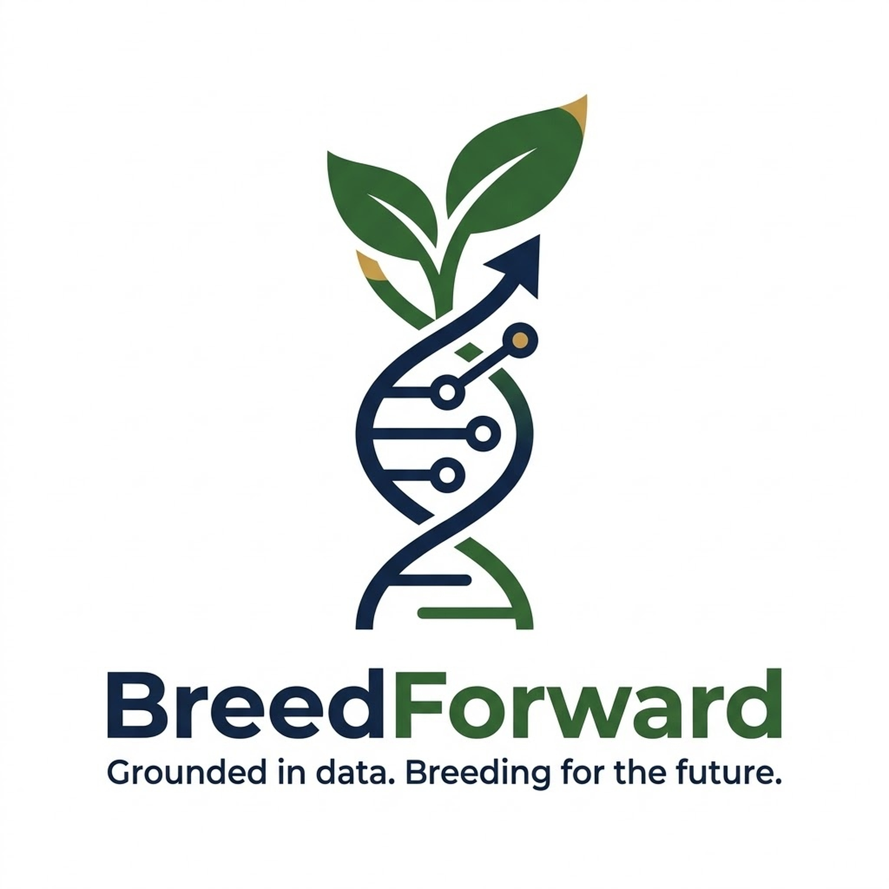
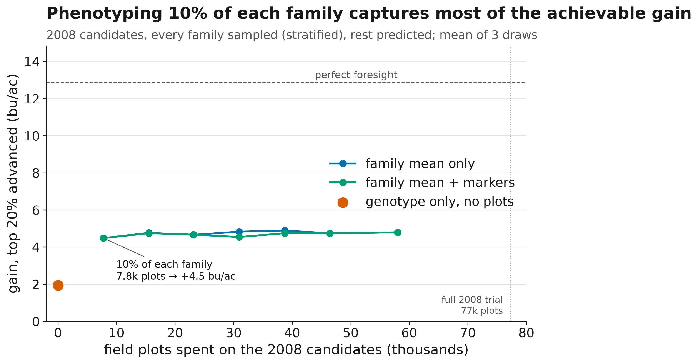
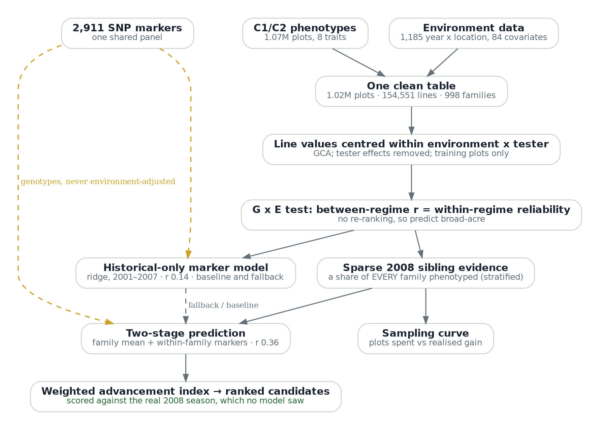

<p align="center">
  
</p>

<h3 align="center">Grounded in data. Breeding for the future.</h3>

<p align="center">
  AI in AG Hackathon with Bayer, University of Arkansas, September 18 to 20, 2026<br>
  Sambhavi Patel, Rushikesh Lagad, Renuka Khanal, Ajaydeep Bedi
</p>

---

## The problem

It is January 2008 at a maize breeding program. The field budget has been cut and there are not enough
plots to grow every candidate line. 15,968 new inbred lines from 998 biparental families are genotyped and
ready to be crossed to testers and planted. The program has seven years of testcross data (2001 to 2007,
about one million plots across 1,185 year by location environments) and one shared 2,911-SNP panel.

The breeder has to decide, before a single 2008 plot is planted, which lines advance and which are dropped.
The question Bayer put to us: given the plot cut, how should the program spend the plots it still has, and
how should it rank lines it cannot afford to test?

## Our hypothesis

Stated so that it could be wrong:

> For a new year and mostly new families, the genotype alone tells you little about a line's yield. Most of
> what can be known about a line lives in its family. So a program facing a plot cut should phenotype a small
> sample of every family rather than every line of a few families, predict the untested siblings from the
> family mean, and use markers only where they add on top of that: grain moisture and test weight, and the
> families with zero plots.

If markers had predicted new-year yield well, or if lines had re-ranked across environments, this would have
been the wrong plan. We tested both.

## What we found

Everything below is scored against the real 2008 season, which the model never saw.

| Claim | Evidence |
|---|---|
| Genotype alone predicts a new year weakly | ridge on 2,911 SNPs, trained 2000 to 2007: r = 0.14 with 2008 line means, +1.7 bu/ac if the top 20% advance, against +12.7 with perfect foresight. Same scheme on 2007: r = 0.07. Accuracy tracks how many new families have a parent seen before (29% in 2008, 15% in 2007), not the model. |
| The plots you have beat the markers | phenotype half of every 2008 family and predict the rest from the family mean: r = 0.36, +4.7 bu/ac. Markers on top add nothing for yield, but lift moisture (0.58 to 0.62) and test weight (0.48 to 0.52). |
| The sampling curve saturates almost at once | 10% of each family phenotyped (7.7k plots) gives r = 0.30 and +3.9 bu/ac. 75% (57k plots) gives 0.37 and +4.8. One seventh of the plots buys 80% of the gain. |
| Broad-acre prediction is the right target | lines do not re-rank across stress regimes: between-regime r 0.23 vs within-regime split-half 0.18 to 0.25, same at parent level. Regime explains 1% of environment mean yield. |
| The advancement index is stable | 500 random weightings of a five-trait index keep 85% overlap with the default advancement set (5th to 95th percentile 68 to 94%). Equal weights are the one choice that breaks it (gain goes negative). |

<p align="center">
  
</p>

**The recommendation.** In a plot-cut year, sample every family thinly, never drop a family, predict the
untested siblings from the family mean plus markers, use markers alone only for families with zero plots,
predict broad-acre rather than environment-specific, and advance on a yield-led index with moisture, test
weight, maturity and observed family lodging.

## Architecture

<p align="center">
  
</p>

| Stage | Script | In | Out |
|---|---|---|---|
| Build | `src/build.py` | C1 and C2 phenotype files, environment covariates | `results/pheno_env_ready.pkl`: 1,019,864 plots, 154,551 lines, 998 families, 1,185 environments, stress regimes from flowering-window weather |
| G x E test | `src/gxe_test.py` | build output, parents from the imputed genotype files | between-regime vs split-half correlations, heritability, regime share of environment mean |
| Genotype-only prediction | `src/predict_multitrait.py` | 2,911-SNP panel, 2000 to 2007 phenotypes | tuned ridge (GBLUP-equivalent), 2007 and 2008 hold-outs, six traits, `results_summary/stage2_results.csv` |
| Sibling-informed prediction | `src/predict_siblings.py`, `src/predict_two_stage.py` | half of each 2008 family as known | family mean, markers plus siblings, two-stage model, breeder's equation, `results/advance2008.csv` |
| Sampling curve | `src/sampling_curve.py` | fraction of each family phenotyped, 3 draws | `results_summary/stage4_sampling_curve.csv` |
| Index sensitivity | `src/weight_sensitivity.py` | 7 named and 500 random weightings | `results_summary/stage5_weight_sensitivity.csv` |
| Figures | `src/figures_results.py` | `results_summary/` only | the five deck figures in `figures/` |
| Demo | `dashboard/app.py` | `results/advance2008.csv` | Streamlit: the breeder moves the index weights and the plot budget and sees the advancement list and its realised 2008 gain |

Design choices, and why: yield is centred within environment by tester before modelling, so the model
predicts general combining ability, not tester-specific effects (SCA is out of scope by the organizers'
statement). Ridge on markers is the GBLUP equivalent; the shrinkage was tuned on a 2007 hold-out, never on
2008. Every result carries two baselines (population mean, parent GCA) and a ceiling (the reliability of the
2008 line means, about 0.68). The mathematics is established on purpose: a weekend is long enough to ask a
sharp question of a large dataset, not to validate a new estimator.

## Reproduce it

```bash
git clone https://github.com/RushiLagad/breedforward-ai-ag-2026.git
cd breedforward-ai-ag-2026
pip install -r requirements.txt
```

Copy the dataset files into `data/` and unzip `ImputedC1Populations.zip` and `ImputedC2Populations.zip`
there, so `data/ImputedPopulationsC1/` and `data/ImputedPopulationsC2/` exist. Then:

```
python src/build.py                # ~2 min
python src/gxe_test.py             # ~3 min
python src/predict_multitrait.py   # ~9 min first run (builds the genotype cache), ~2 min after
python src/predict_siblings.py     # ~1 min, writes results/advance2008.csv
python src/predict_two_stage.py    # seconds
python src/sampling_curve.py       # ~1 min
python src/weight_sensitivity.py   # seconds
python src/figures_results.py      # the five deck figures
streamlit run dashboard/app.py
```

Reproduced end to end on a second machine (Windows, miniforge) on Sep 19: every stage, every number identical.

**Nothing from the hackathon dataset gets committed.** `data/` and `results/` are gitignored, and so are
`*.csv`, `*.parquet` and `*.xlsx`. The organizers marked the materials confidential. Only the small
summary tables in `results_summary/` and the figures are versioned.

## Layout

```
src/build.py               clean build of both groups + environment -> results/pheno_env_ready.pkl
src/gxe_test.py            between-regime vs split-half correlation (the honest G x E test)
src/predict_multitrait.py  tuned ridge, 2007 + 2008 hold-outs, six traits
src/predict_siblings.py    half of each 2008 family phenotyped, predict the rest; advancement list
src/predict_two_stage.py   sibling mean + within-family marker model (Mendelian sampling term)
src/sampling_curve.py      fraction of each family phenotyped vs realised gain
src/weight_sensitivity.py  how the advancement list moves with index weights
src/figures_results.py     the five deck figures, from results_summary/ only
src/style.py               one visual system for every plot
src/predict2008.py         first pass at the scenario (superseded by predict_multitrait)
src/audit.py               structure audit for an unknown dataset
src/legacy/                pre-scenario scripts; not used
dashboard/app.py           Streamlit demo, reads results/advance2008.csv, never fits a model
deck/                      workflow schematic (png + dot source), slide outline
docs/                      challenge brief, decision log, pitch outline, branding
assets/                    team logo
figures/                   the five deck figures
results_summary/           small result tables that back every number in this README
data/, results/            gitignored (dataset and derived tables)
```

## Team

| Person | Lane |
|---|---|
| Sambhavi Patel | Data: build, QC, traps, reproduction |
| Rushikesh Lagad | Modeling: prediction, validation, sampling curve, index |
| Renuka Khanal | Visualization: figures, dashboard, demo |
| Ajaydeep Bedi | Story: deck, narrative, rehearsal clock |

Everyone pushes to `main`, small commits, no long-lived branches. Any number that goes in the deck is
reproduced by a second person from this repo. Decisions and their reasons are in `docs/decision-log.md`.

---

## Detailed results

The evidence behind the table above, stage by stage.

### Stage 1: the data, and two traps in it

- 1,019,864 plots, 154,551 lines, 998 families, 1,185 environments after the merge. 52k C2 rows have no environment row and drop.
- Every line is tested in exactly one year. LINE is unique only within a family; key on LINE_UNIQUE_ID.
- The C2 phenotype file stores LINE as `12.0` and LINE_UNIQUE_ID as `C2.1.12.0`; strip the `.0` before matching genotypes. 3.9% of rows have no tester ID.
- 15,968 lines in the raw 2008 files, 15,967 after the environment join, 15,959 with a scorable 2008 yield.
- Line-mean heritability of yield is 0.48 at about 7 plots. GCA ranking is meaningful.
- The data guide's column names do not match the files (YEAR_x, X04_PRCP, clay_0_5cm, no TMAX/TMIN). `src/build.py` uses the real names.

### Stage 2: genotype-only prediction, two validation years, six traits

| Hold-out year | r markers, yield | top-20% gain | ceiling r | families with both parents seen before |
|---|---|---|---|---|
| 2007 (train 2000 to 2006) | 0.07 | +0.5 of +12.5 bu/ac | 0.63 | 15% |
| 2008 (train 2000 to 2007) | 0.14 | +1.9 of +12.7 bu/ac | 0.68 | 29% |

Baselines on 2008: population mean from earlier years r ~ 0 (+0.04 bu/ac), parent GCA r 0.11 (+1.30),
markers plus parent GCA r 0.15 (+1.76). Traits (2008, markers): TWT 0.23, MST 0.18, YLD 0.14, ERM 0.14,
STLP 0.05, RTLP ~0. Lodging is not predictable here; it is carried as an observed family penalty. Heavy
shrinkage (h2 ~ 0.1) won the tuning. This is the CV00 scheme (new lines, new year); the literature reports
near zero for it.

### Stage 3: the plots you have beat the markers

Half of each 2008 family phenotyped, predict the other half. Yield, top-20% advancement, +12.6 bu/ac possible:

| What you know about a 2008 line | r | gain captured |
|---|---|---|
| genotype only (pure new year) | 0.13 | +1.7 |
| genotype, siblings pooled into training | 0.24 | +3.0 |
| mean of phenotyped siblings, no markers | **0.36** | **+4.7** |
| sibling mean + within-family marker model | 0.35 | +4.3 |

Markers add on top of the sibling mean for MST (0.58 to 0.62) and TWT (0.48 to 0.52), not for yield.
Breeder's equation, top 20% advanced, additive sd ~6.3 bu/ac: r 0.14 gives +1.2, r 0.35 gives +3.1,
r 0.50 gives +4.4 bu/ac per cycle. 2008 as run was 77,353 plots; sampling half saves ~39,000 plots and
keeps ~70% of the gain.

### Stage 4: the sampling curve

Phenotype a random fraction of every 2008 family, predict the rest from the family mean, score against
real 2008 yield. Mean of 3 draws, top-20% advancement:

| share of each family phenotyped | plots | r (family mean) | gain bu/ac |
|---|---|---|---|
| 0% (genotype only) | 0 | 0.13 | +1.7 |
| 10% | 7.7k | 0.30 | +3.9 |
| 20% | 15k | 0.33 | +4.1 |
| 50% | 38k | 0.35 | +4.6 |
| 75% | 57k | 0.37 | +4.8 |
| perfect foresight | | | +12.7 |

Markers on top of the family mean add r 0.37 to 0.40 only at high sampling.

### Stage 5: index-weight sensitivity

Index = 0.5 yield + 0.1 TWT - 0.15 MST - 0.05 ERM - 0.2 family lodging, on z-scores. Realised 2008
outcomes of the flagged top 20%:

| weighting | yield gain bu/ac | moisture (z) | family lodging (z) | overlap with default set |
|---|---|---|---|---|
| yield only | +2.96 | +0.24 (wetter) | -0.69 | 69% |
| default | +2.64 | -0.02 | -1.75 | 100% |
| yield-heavy | +3.02 | +0.14 | -1.17 | 80% |
| moisture-heavy (-0.35) | +1.81 | -0.24 | -1.50 | 78% |
| lodging-heavy (-0.40) | +2.92 | 0.00 | -2.21 | 88% |
| equal weights | -0.39 | -0.39 | -1.41 | 45% |

500 random weightings: overlap median 85% (5th to 95th 68 to 94%), realised gain median +2.62 bu/ac
(+1.47 to +3.20). The default trades ~0.3 bu/ac of yield for drier grain and much lower lodging risk. The
weights are the breeder's lever and the demo exposes them.

### G x E, tested rather than assumed

Stress regimes from flowering-window weather (July plus August precipitation minus cooling degree days,
tertiles over unique environments). Line effects between HotDry and CoolWet: r 0.23. Split-half within a
regime: 0.18 to 0.25. Parents with 30 or more environments: between 0.50, within 0.45 to 0.64. If lines
re-ranked, between would sit well below within. It does not, so broad-acre prediction is the target.

## How we talk about it

The framing is ours, the mathematics is established, and we chose established mathematics because a
weekend is not long enough to validate a new estimator. Every number in this README is in
`results_summary/` and was reproduced on a second machine.
